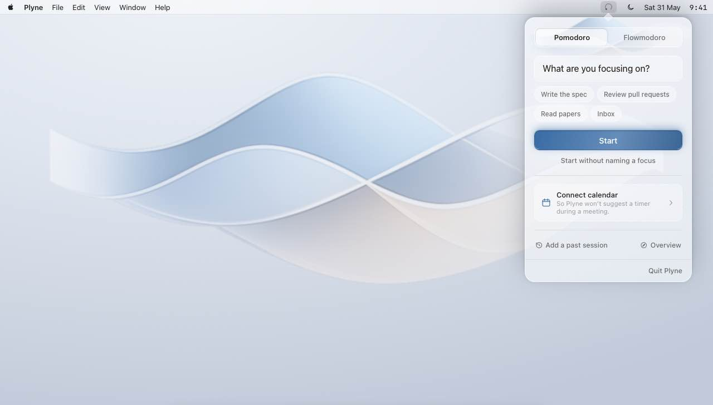
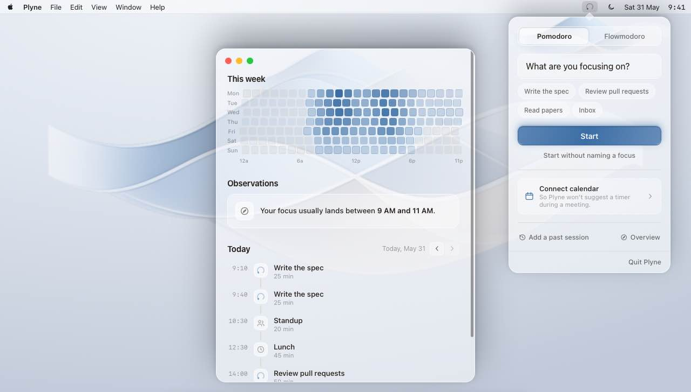

# Plyne

> **Quiet focus for macOS.**

Plyne is a free, open-source, native menu-bar app for macOS that helps you hold focus
through a hybrid Pomodoro/Flowmodoro timer. It gives you a calm, factual picture of your
day — it observes, it doesn't judge. No streaks, no leaderboards, no productivity score,
no subscriptions, and nothing leaves your Mac.

[](https://github.com/MolodykhV/Plyne/actions/workflows/ci.yml)
[](LICENSE)

-blue)

<p align="center">
  
</p>

## What it does

Start a session with a single hotkey, work, and at the end of the day see an honest,
unhurried summary of your rhythm.

- **Hybrid timer.** Pomodoro (fixed length) and Flowmodoro (open-ended, with a break that
  grows proportionally to how long you worked) in one place. An *overflow* phase lets a
  session run a few minutes past the bell instead of cutting you off.
- **Intention, not a to-do list.** An optional one-line note on what this session is for,
  with suggestions drawn from your recent intentions. Skipping it is always fine.
- **Calendar awareness (opt-in, read-only).** If you connect your macOS calendar, Plyne
  reads today's events to show them on your timeline and to step back during a meeting —
  it offers to start anyway rather than nagging or blocking. Calendar access is optional
  and the data never leaves your Mac.
- **Retroactive entry.** Forgot to start the timer? Add a past session by hand. An overlap
  with an existing session is a quiet note, not an error.
- **A calm dashboard.** A vertical timeline of your day and a week heatmap of focus minutes.
  No grades, no "best day" badge, no red days.
- **Gentle observations.** Occasional factual notes — e.g. *"Your focus usually lands
  between 9 AM and 11 AM."* When the signal is weak, Plyne says nothing rather than
  inventing a verdict.
- **Native and quiet.** A Liquid Glass interface built with SwiftUI for macOS 26 (Tahoe),
  living in the menu bar with no Dock icon. It respects Reduce Transparency, Increase
  Contrast and Reduce Motion. Localized in English and Russian.

<p align="center">
  
</p>

## What it refuses to be

These are deliberate, not missing features:

- No streaks to break, no leaderboards, no social comparison.
- No single "productivity score" and no good/bad days.
- No notifications that nag you for not showing up.
- No telemetry, no analytics, no cloud by default. No account, no subscription.
- No hard blocking you can't turn off.

## Requirements

- macOS 26 (Tahoe) or newer.
- Apple silicon or Intel.

## Install

1. Download `Plyne-v0.1.0.zip` from the [latest release](https://github.com/MolodykhV/Plyne/releases).
2. Unzip it and move `Plyne.app` to `/Applications`.
3. The build is ad-hoc signed (there is no Apple Developer ID yet), so macOS will block it
   as coming from an "unidentified developer" on first launch. To allow it:

   ```bash
   xattr -dr com.apple.quarantine /Applications/Plyne.app
   open /Applications/Plyne.app
   ```

4. Plyne appears in the menu bar. Connecting your calendar is optional and asked for only
   when you choose it. Notarization will come in a later release.

## Keyboard shortcuts

| Shortcut | Action |
|---|---|
| ⌃⌥⌘ P | Start / stop the current session |
| ⌃⌥⌘ M | Switch between Pomodoro and Flowmodoro |
| ⌃⌥⌘ D | Open the dashboard |

Shortcuts can't be customized in this release; remappable bindings are planned.

## Privacy

Plyne keeps everything on your device. There are no outbound network calls, no telemetry,
and no third-party services. Your sessions live in a local SwiftData store under
`~/Library/Application Support/`. Calendar access is opt-in, read-only, and used only to
draw your day and to recognize when you're in a meeting — calendar contents are never
stored or sent anywhere.

## Build from source

The Xcode project is generated from `project.yml` by [XcodeGen](https://github.com/yonaskolb/XcodeGen);
`Plyne.xcodeproj` is not committed.

```bash
brew install xcodegen
xcodegen generate

# Build the app (macOS)
xcodebuild -project Plyne.xcodeproj -scheme Plyne -configuration Debug \
  -destination 'platform=macOS' build

# Pure-Swift package tests (run anywhere, including Linux)
swift test --package-path Packages/PlyneCore
swift test --package-path Packages/PlyneAnalytics
swift test --package-path Packages/PlyneTimer
```

The logic is split into small Swift packages — pure, platform-independent ones
(`PlyneCore`, `PlyneAnalytics`, `PlyneTimer`) and macOS-only ones (`PlyneStorage`,
`PlyneCalendar`) — with the SwiftUI app shell in `App/`.

> The bundle identifier is currently `app.plyne.Plyne`, a placeholder until an Apple
> Developer account is in place.

## Roadmap

v0.1.0 is an early but complete focus timer with calm analytics. Planned next, behind
explicit opt-in and the same privacy posture:

- A silent, on-device activity tracker that attributes time without you having to label it.
- Slack status / Do Not Disturb on session start, Shortcuts and Focus Filters.
- Richer weekly observations and an on-device day/week summary.
- Notarized builds and a Homebrew Cask.

## License

[MIT](LICENSE).
